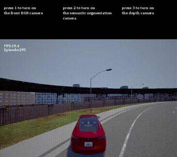

# auto-driving_based_on_RL
My undergraduate thesis. Implemented auto-driving in DonkeyCar simulator using reinforcement learning algorithms(DDPG, SAC, A3C).

### Introduction ###
In this work, I implemented some RL algorithms on DonkeyCar Simulator, finally I made the car drive in the track successful.
And did some try on CARLA simulator.

### Achievement ###
After testing, the best performance in this scenario is the SAC algorithm.
CTE=1，alpha=0.1

The car drives smoothly, but cannot stay in the center of the track.

CTE=5, alpha=0.1

The car drives in the center of the track, but not very smooth.

### CARLA ###
Actually I think CARLA is a better simulator for this research, because it has more useful functions and it's more like the real world. But because of the communication problems and insufficient GPU, I couldn't do the training on CARLA, just made some interfaces.

